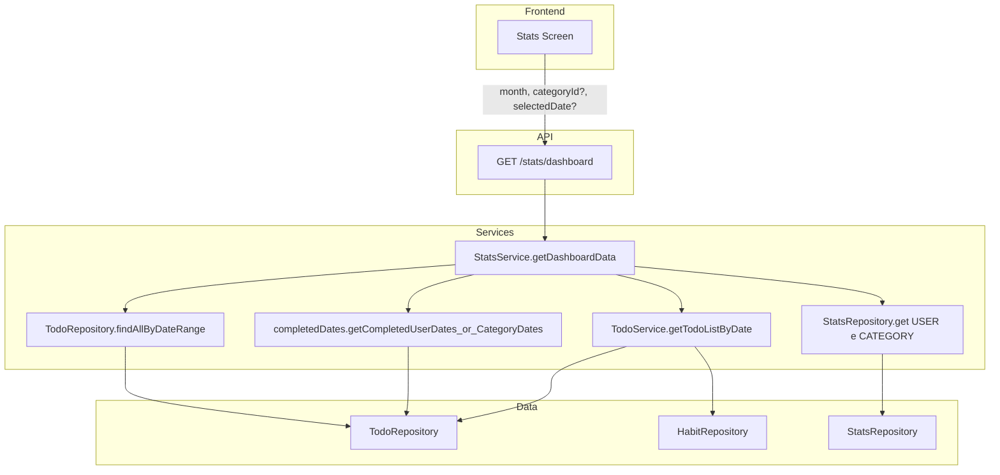

# Plano: Endpoint de Estatísticas para a Tela de Dashboard

## Arquitetura Atual (pós-refatoração)

O projeto usa:

- **Tsyringe**: serviços e repositórios são `@injectable()`, resolvidos via `container.resolve(Service)`.
- **Zod**: validação via `zodValidator(schema)` no Middy; schemas em `src/schemas/*.schemas.ts`.
- **Powertools**: `logger` para logs estruturados (INFO/WARN/DEBUG); `tracer` para tracing.
- **Controller pattern**: `getUserId(event)`, `getStatsService = () => container.resolve(StatsService)`, `logger.info(...)` para operações.
- **Handlers**: Todo handler inclui stats routes (`[...todoRoutes, ...statsRoutes]`); `/stats/*` usa `TodoLambdaFunction` no OpenAPI.

## Contexto

A tela de estatísticas do frontend precisa de:

1. **Calendário mensal** – dias em que todos os TODOs foram completados (com aparência diferente)
2. **Filtro por categoria** – ao selecionar uma categoria, o calendário mostra apenas os hábitos dessa categoria
3. **Lista de hábitos** – ao selecionar um dia, exibe os hábitos programados para aquele dia (respeitando o filtro de categoria)
4. **Indicadores** – streaks (global e, quando houver filtro, da categoria), maior sequência, total de dias completos, resumo do mês

## Situação Atual

| Recurso                      | Endpoint existente                      | Gap                                                                                  |
| ---------------------------- | --------------------------------------- | ------------------------------------------------------------------------------------ |
| Calendário (datas completas) | `GET /todo/summary?startDate=&endDate=` | Retorna dados brutos; o frontend pode derivar, mas sem filtro de categoria explícito |
| Hábitos do dia               | `GET /todo/date?date=`                  | Não suporta filtro por `categoryId`                                                  |
| Streak global                | `GET /stats/globalStreak`               | OK                                                                                   |
| Streak da categoria          | -                                       | Não existe                                                                           |

## Abordagem: Endpoint Consolidado com Reutilização

Criar um único endpoint `GET /stats/dashboard` que retorne tudo em uma chamada, reutilizando ao máximo funções existentes (evitando N chamadas por dia no mês).

### Estrutura do Endpoint

**Rota:** `GET /stats/dashboard`

**Query params:**

- `month` (obrigatório): `YYYY-MM` – mês do calendário
- `categoryId` (opcional): filtra por categoria
- `selectedDate` (opcional): `YYYY-MM-DD` – dia selecionado; quando informado, inclui a lista de hábitos

### JSON de retorno

**Campos sempre presentes:**

| Campo                    | Tipo       | Descrição                                                                    |
| ------------------------ | ---------- | ---------------------------------------------------------------------------- | ------------------------------------------------------------------- |
| `completedDates`         | `string[]` | Datas (YYYY-MM-DD) do mês em que todos os TODOs (ou da categoria) estão DONE |
| `globalStreak`           | `number`   | Sequência atual do usuário                                                   |
| `globalLongestStreak`    | `number`   | Maior sequência já alcançada (Stats USER)                                    |
| `globalTotalCompletions` | `number`   | Total de dias "100% completos" do usuário                                    |
| `lastCompletedDate`      | `string    | null`                                                                        | Última data em que o usuário fechou o dia 100% (YYYY-MM-DD ou null) |
| `monthCompletionCount`   | `number`   | Quantidade de dias completos no mês (= completedDates.length)                |
| `monthCompletionRate`    | `number`   | completedDates.length / dias do mês (ex.: 0.58)                              |
| `daysInMonth`            | `number`   | Número de dias do mês (ex.: 31)                                              |

**Presente apenas quando `selectedDate` é enviado:**

| Campo                   | Tipo         | Descrição                                                                          |
| ----------------------- | ------------ | ---------------------------------------------------------------------------------- |
| `habitsForSelectedDate` | `TodoList[]` | Lista de hábitos do dia (mesma estrutura de GET /todo/date), com streak por hábito |

**Presente apenas quando `categoryId` é enviado:**

| Campo                      | Tipo     | Descrição                            |
| -------------------------- | -------- | ------------------------------------ |
| `categoryStreak`           | `number` | Sequência atual da categoria         |
| `categoryLongestStreak`    | `number` | Maior sequência da categoria         |
| `categoryTotalCompletions` | `number` | Total de dias completos da categoria |

**Exemplo sem selectedDate e sem categoryId:**

```json
{
    "completedDates": ["2025-01-03", "2025-01-05", "2025-01-08", "2025-01-12"],
    "globalStreak": 5,
    "globalLongestStreak": 12,
    "globalTotalCompletions": 48,
    "lastCompletedDate": "2025-01-28",
    "monthCompletionCount": 4,
    "monthCompletionRate": 0.129,
    "daysInMonth": 31
}
```

**Exemplo com selectedDate e categoryId:**

```json
{
    "completedDates": ["2025-01-05", "2025-01-12"],
    "habitsForSelectedDate": [
        {
            "id": "habit-1",
            "title": "Leitura",
            "color": "#4CAF50",
            "emoji": "📖",
            "unit": "pages",
            "targetValue": "10",
            "period": "Morning",
            "active": true,
            "categoryId": "cat-1",
            "status": "done",
            "progressValue": "10",
            "notes": "",
            "streak": 3,
            "updatedAt": "2025-01-12T14:00:00.000Z"
        }
    ],
    "globalStreak": 5,
    "globalLongestStreak": 12,
    "globalTotalCompletions": 48,
    "lastCompletedDate": "2025-01-28",
    "monthCompletionCount": 2,
    "monthCompletionRate": 0.065,
    "daysInMonth": 31,
    "categoryStreak": 3,
    "categoryLongestStreak": 8,
    "categoryTotalCompletions": 22
}
```

## Reutilização de Código Existente

| Dado do dashboard                                               | O que reutilizar                                                                                                                                                                                                                                                                                                                              |
| --------------------------------------------------------------- | --------------------------------------------------------------------------------------------------------------------------------------------------------------------------------------------------------------------------------------------------------------------------------------------------------------------------------------------- |
| completedDates                                                  | [TodoRepository.findAllByDateRange](src/repositories/TodoRepository.ts) (1 chamada para o mês) + [getCompletedUserDatesFromTodoList](src/services/stats/completedDates.ts) / [getCompletedCategoryDatesFromTodoList](src/services/stats/completedDates.ts) + [HabitService.getAllHabits](src/services/HabitService.ts) (só quando categoryId) |
| habitsForSelectedDate                                           | [TodoService.getTodoListByDate](src/services/TodoService.ts)(userId, date, categoryId?) – estender com parâmetro opcional `categoryId`                                                                                                                                                                                                        |
| globalStreak                                                    | [StatsService.getGlobalStreak](src/services/StatsService.ts)                                                                                                                                                                                                                                                                                  |
| globalLongestStreak, globalTotalCompletions, lastCompletedDate  | Stats USER: repository.get(PK, SK_USER) – ler longestStreak, totalCompletions, lastCompletedDate (retornar 0 ou null se não existir)                                                                                                                                                                                                          |
| categoryStreak, categoryLongestStreak, categoryTotalCompletions | Stats CATEGORY: getHabitStats(scope: "CATEGORY", habitId: "", categoryId) ou novo getCategoryStreak / getCategoryStats que retorne currentStreak, longestStreak, totalCompletions (0 quando stats não existir)                                                                                                                                |
| monthCompletionCount, monthCompletionRate, daysInMonth          | Derivados: completedDates.length, length/daysInMonth, e cálculo do último dia do mês                                                                                                                                                                                                                                                          |

Não usar getDailySummary para completedDates (evitar N chamadas); usar 1x findAllByDateRange + funções puras de completedDates.ts.

## Implementação

### 1. `StatsService` – método `getDashboardData`

Arquivo: [src/services/StatsService.ts](src/services/StatsService.ts)

- O `StatsService` é `@injectable()` e usa `repository`, `todoRepository`, `habitService`; para `getTodoListByDate` usa o getter lazy `todoService` (resolução circular).
- **Parâmetros:** `userId`, `month` (YYYY-MM), `categoryId?`, `selectedDate?`.
- **completedDates:** firstDay = `${month}-01`; último dia do mês (ex.: `new Date(y, m, 0).toISOString().slice(0, 10)`); `todos = await this.todoRepository.findAllByDateRange(userId, firstDay, lastDay)`; se categoryId: obter habitIds da categoria via habitService.getAllHabits + filter, depois `getCompletedCategoryDatesFromTodoList(todos, habitIds)`; senão `getCompletedUserDatesFromTodoList(todos)`; retornar `Array.from(set)`.
- **habitsForSelectedDate:** Se selectedDate: `await this.todoService.getTodoListByDate(userId, selectedDate, categoryId)`; senão undefined.
- **Global:** Chamar repository.get para Stats USER; preencher globalStreak, globalLongestStreak, globalTotalCompletions, lastCompletedDate (0 ou null quando não existir).
- **Category:** Se categoryId: repository.get para Stats CATEGORY; preencher categoryStreak, categoryLongestStreak, categoryTotalCompletions (0 quando não existir).
- **Resumo mês:** monthCompletionCount = completedDates.length; daysInMonth = dias do mês; monthCompletionRate = count / daysInMonth.
- Importar `getCompletedUserDatesFromTodoList` e `getCompletedCategoryDatesFromTodoList` de [src/services/stats/completedDates.ts](src/services/stats/completedDates.ts).
- Adicionar logs: `logger.info("Stats getDashboardData", {...})` no início e, se relevante, em decisões importantes.

### 2. `TodoService` – suporte a filtro por categoria

Arquivo: [src/services/TodoService.ts](src/services/TodoService.ts)

- Assinatura: `getTodoListByDate(userId: string, date: string, categoryId?: string): Promise<TodoList[]>`.
- Após obter `eligibleHabits`, se `categoryId` informado: `eligibleHabits = eligibleHabits.filter((h) => h.categoryId === categoryId)`.
- Resto da lógica inalterado.

### 3. `StatsService` – métodos para categoria (opcional)

- `getCategoryStreak(userId, categoryId): Promise<number>` – repository.get(USER scope CATEGORY); retornar `stats?.currentStreak ?? 0`.
- Ou, em getDashboardData, ler Stats CATEGORY uma vez e preencher categoryStreak, categoryLongestStreak, categoryTotalCompletions.

### 4. Schema Zod para validação

Arquivo: [src/schemas/stats.schemas.ts](src/schemas/stats.schemas.ts) (novo)

- Criar `getDashboardSchema` com `queryStringParameters`:
  - `month`: `z.string().regex(/^\d{4}-\d{2}$/)` (obrigatório)
  - `categoryId`: `z.string().optional()`
  - `selectedDate`: `z.string().regex(/^\d{4}-\d{2}-\d{2}$/).optional()`
- Exportar tipo `GetDashboardInput` via `z.infer<typeof getDashboardSchema>`.

### 5. Controller e rota

Arquivo: [src/controllers/stats.controller.ts](src/controllers/stats.controller.ts)

- Nova rota `GET /stats/dashboard` com `authMiddleware()` e `zodValidator(getDashboardSchema)`.
- Extrair `month`, `categoryId`, `selectedDate` de `event.validated.queryStringParameters`.
- Obter `userId` via `getUserId(event)`.
- Resolver `StatsService` via `container.resolve(StatsService)` (padrão existente: `getStatsService()`).
- Chamar `getStatsService().getDashboardData(userId, month, categoryId, selectedDate)` e retornar o JSON descrito acima.
- Adicionar `logger.info("Stats getDashboard", { userId, month, categoryId, selectedDate })` e log de resultado (ex.: `logger.info("Stats getDashboard result", { userId, monthCompletionCount })`).

### 6. OpenAPI e deployment

- [deployment/openapi.yaml](deployment/openapi.yaml): documentar `GET /stats/dashboard` com parâmetros (`month`, `categoryId`, `selectedDate`) e schema de resposta (todos os campos descritos).
- A rota de stats usa o `TodoLambdaFunction` (já integrado ao handler de todo); nenhuma alteração no `template.yaml` é necessária.

## Fluxo de Dados



- **completedDates:** 1x findAllByDateRange + funções puras de completedDates.ts (sem N chamadas por dia).
- **habitsForSelectedDate:** getTodoListByDate(userId, selectedDate, categoryId?).
- **Streaks e totais:** leitura direta de Stats (USER e CATEGORY) via StatsRepository.get.

## Alternativa

Se preferir manter os endpoints atuais e apenas estendê-los:

- Adicionar `categoryId` opcional em `GET /todo/date` e `GET /todo/summary`.
- Criar `GET /stats/categoryStreak?categoryId=`.
- O frontend faria várias chamadas (summary + date + globalStreak + categoryStreak).

Isso funciona, mas aumenta o número de requisições e a lógica no frontend.
