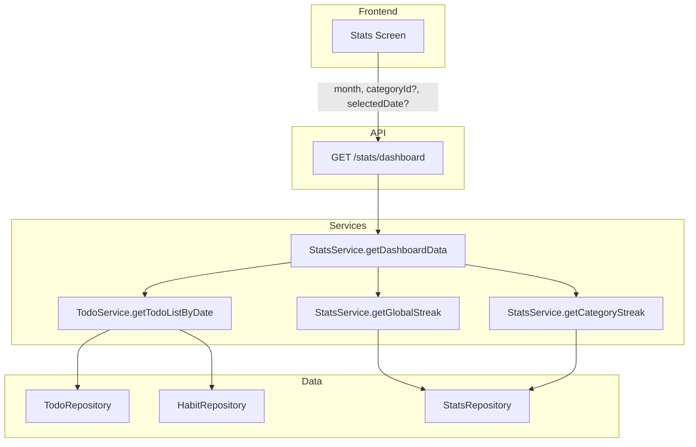

# Plano: Endpoint de Estatísticas para a Tela de Dashboard

## Contexto

A tela de estatísticas do frontend precisa de:

1. **Calendário mensal** – dias em que todos os TODOs foram completados (com aparência diferente)
2. **Filtro por categoria** – ao selecionar uma categoria, o calendário mostra apenas os hábitos dessa categoria
3. **Lista de hábitos** – ao selecionar um dia, exibe os hábitos programados para aquele dia (respeitando o filtro de categoria)
4. **Indicadores** – streaks (global e, quando houver filtro, da categoria)

## Situação Atual

| Recurso                      | Endpoint existente                      | Gap                                                                                  |
| ---------------------------- | --------------------------------------- | ------------------------------------------------------------------------------------ |
| Calendário (datas completas) | `GET /todo/summary?startDate=&endDate=` | Retorna dados brutos; o frontend pode derivar, mas sem filtro de categoria explícito |
| Hábitos do dia               | `GET /todo/date?date=`                  | Não suporta filtro por `categoryId`                                                  |
| Streak global                | `GET /stats/globalStreak`               | OK                                                                                   |
| Streak da categoria          | -                                       | Não existe                                                                           |

## Abordagem Recomendada: Endpoint Consolidado

Criar um único endpoint `**GET /stats/dashboard**` que retorne tudo em uma chamada:

- Menos requisições HTTP
- Lógica centralizada
- Fácil de evoluir (mais indicadores no futuro)

### Estrutura do Endpoint

**Rota:** `GET /stats/dashboard`

**Query params:**

- `month` (obrigatório): `YYYY-MM` – mês do calendário
- `categoryId` (opcional): filtra por categoria
- `selectedDate` (opcional): `YYYY-MM-DD` – dia selecionado; quando informado, inclui a lista de hábitos

**Exemplo de resposta:**

```json
{
  "completedDates": ["2024-01-01", "2024-01-03", "2024-01-05"],
  "habitsForSelectedDate": [
    { "id": "...", "title": "Leitura", "status": "done", "streak": 3, ... }
  ],
  "globalStreak": 5,
  "categoryStreak": 3
}
```

- `completedDates`: datas em que todos os TODOs (ou da categoria, se filtrada) foram completados
- `habitsForSelectedDate`: somente presente se `selectedDate` for enviado; lista de `TodoList` para o dia
- `globalStreak`: streak do usuário (sempre presente)
- `categoryStreak`: presente apenas quando `categoryId` é informado

## Implementação

### 1. `StatsService` – método `getDashboardData`

Arquivo: [src/services/StatsService.ts](src/services/StatsService.ts)

- **Calcular `completedDates`:**  
  Reusar a lógica de `TodoService.getDailySummary`: para cada dia no mês, obter `getTodoListByDate` e considerar o dia completo quando:
    - todos os hábitos do dia estão `DONE`, e
    - há pelo menos um hábito programado
- **Com filtro `categoryId`:**  
  Filtrar hábitos por `categoryId` antes de aplicar a mesma regra.
- `**habitsForSelectedDate`:  
  Chamar `TodoService.getTodoListByDate` para `selectedDate` e, se `categoryId` existir, filtrar por `categoryId`.
- `**globalStreak`:  
  `StatsService.getGlobalStreak(userId)`.
- `**categoryStreak`:  
  Novo método `getCategoryStreak(userId, categoryId)` usando `getHabitStats` com `scope: "CATEGORY"`.

### 2. `TodoService` – suporte a filtro por categoria

Arquivo: [src/services/TodoService.ts](src/services/TodoService.ts)

- Adicionar parâmetro opcional `categoryId?: string` em `getTodoListByDate`.
- Se `categoryId` for informado, filtrar os hábitos retornados por `habit.categoryId === categoryId`.

### 3. Novo método `getCategoryStreak` em `StatsService`

Arquivo: [src/services/StatsService.ts](src/services/StatsService.ts)

- `getCategoryStreak(userId: string, categoryId: string): Promise<number>`
- Usar `getHabitStats({ scope: "CATEGORY", userId, habitId: "", categoryId })` e retornar `currentStreak`.

### 4. Controller e rota

Arquivo: [src/controllers/stats.controller.ts](src/controllers/stats.controller.ts)

- Nova rota `GET /stats/dashboard`.
- Extrair `month`, `categoryId`, `selectedDate` de `queryStringParameters`.
- Validar `month` (obrigatório, formato `YYYY-MM`).
- Chamar `StatsService.getDashboardData` e retornar o JSON acima.

### 5. OpenAPI e deployment

- [deployment/openapi.yaml](deployment/openapi.yaml): documentar `GET /stats/dashboard` com parâmetros e schema de resposta.
- A rota de stats usa o `TodoLambdaFunction` (como `/stats/globalStreak`); nenhuma alteração no `template.yaml` é necessária.

## Fluxo de Dados



## Alternativa

Se preferir manter os endpoints atuais e apenas estendê-los:

- Adicionar `categoryId` opcional em `GET /todo/date` e `GET /todo/summary`.
- Criar `GET /stats/categoryStreak?categoryId=`.
- O frontend faria várias chamadas (summary + date + globalStreak + categoryStreak).

Isso funciona, mas aumenta o número de requisições e a lógica no frontend.
