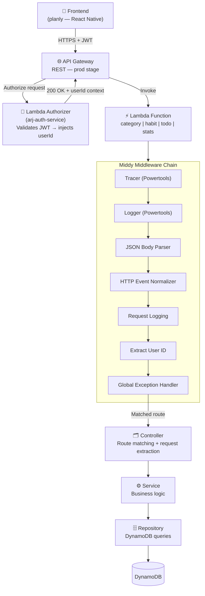

# planly-api


Backend of the **Planly** application — a habit tracking platform. The API manages habits, categories, daily to-dos, and streak statistics, exposed through AWS API Gateway with independent Lambda functions per domain.

**Related repositories:**
- [`arj-auth-service`](../arj-auth-service) — Lambda Authorizer that validates JWT tokens and injects `userId` into the request context
- [`common-utils-layer`](../common-utils-layer) — shared Lambda layer with utilities, middlewares, and common repositories
- [`planly`](../planly) — React Native / Expo mobile app

---

## How it works

The API follows a serverless, domain-driven architecture with four independent Lambda functions (`category`, `habit`, `todo+stats`, `stats-midnight`). Every HTTP request flows through a fixed middleware chain before reaching business logic. Authentication is fully delegated to the external `arj-auth-service` Lambda Authorizer, which validates the JWT and injects the `userId` so the functions never handle tokens directly. Persistence uses DynamoDB, with a single-table design for the `todo` and `stats` domains. The `stats-midnight` function is an EventBridge-scheduled job that runs daily at 00:01 (GMT-3) to recalculate streaks for any habit the user did not interact with the day before.

## Architecture



---

## Running locally with Docker

### Prerequisites

- [Docker](https://www.docker.com/) and Docker Compose
- [AWS SAM CLI](https://docs.aws.amazon.com/serverless-application-model/latest/developerguide/install-sam-cli.html)
- Node.js 20+

### 1. Pull images and start containers

```bash
npm run docker:up
```

Starts **DynamoDB Local** on port `8000` inside the `planly-network` bridge network.

### 2. Create and seed tables

```bash
npm run docker:init-db
```

Creates all required DynamoDB tables:

| Table | Primary Key | GSIs |
|-------|-------------|------|
| `user` | `userId` | — |
| `planly-category` | `id` | `userId-index` |
| `planly-habit` | `id` | `userId-index`, `userId-start_date-index` |
| `planly-todo` | `PK` / `SK` | `habitId-index`, `userId-date-index` |
| `planly-stats` | `PK` / `SK` | — |

To insert a test user:

```bash
DYNAMODB_ENDPOINT=http://localhost:8000 ./scripts/populate-user.sh
```

### 3. Start the local API

```bash
npm run dev
```

API available at `http://localhost:3000` via SAM Local.

To start with debugger on port `9229`:

```bash
npm run dev:debug
```

### 4. Browse the Swagger docs

```bash
npm run swagger
```

Available at `http://localhost:8080`.

### Stop containers

```bash
npm run docker:down
```

---

## Build

```bash
npm run build
```

Compiles TypeScript from `src/` to `dist/` using `tsconfig.json`.

---

## Unit tests

```bash
npm test
```

Watch mode for development:

```bash
npm run test:watch
```

Coverage report (minimum threshold: 80%):

```bash
npm run test:coverage
```

Tests live under `tests/` and use **Vitest** with `vi.mock` for dependency isolation.

---

## Deploy to AWS

### Prerequisites

- AWS CLI configured with the appropriate credentials
- SAM CLI installed
- Permissions to create Lambda, API Gateway, DynamoDB tables, and IAM Roles
- `arj-auth-service` already deployed (its Lambda ARN is read from SSM at `/arj-auth/authorizer-function-arn`)

### Run the deploy

```bash
npm run deploy
```

This script runs:

```bash
npm run build
sam build --template-file deployment/template.yaml
sam deploy --capabilities CAPABILITY_NAMED_IAM
```

Deploy configuration is in `deployment/samconfig.toml` (stack `planly-api`, region `us-east-1`).

### AWS resources created

| Resource | Details |
|----------|---------|
| API Gateway | REST API `PlanlyApi` — stage `prod` |
| Lambda × 4 | `category`, `habit`, `todo`, `stats-midnight` with dedicated IAM Roles |
| EventBridge Schedule | Triggers `stats-midnight` daily at 00:01 GMT-3 |
| IAM Roles | One per Lambda + one for the EventBridge scheduler |

The API URL is printed as a stack output after deploy:

```
https://{api-id}.execute-api.us-east-1.amazonaws.com/prod/
```

---

## Environment variables

Used locally via `deployment/env.json`:

| Variable | Description |
|----------|-------------|
| `AWS_REGION` | AWS region (`us-east-1`) |
| `NODE_ENV` | Runtime environment (`development`) |
| `DYNAMODB_ENDPOINT` | DynamoDB Local endpoint (`http://dynamodb:8000`) |
| `POWERTOOLS_LOG_LEVEL` | Log verbosity (`DEBUG`) |

In production, variables are managed by the SAM template and AWS Secrets Manager.
